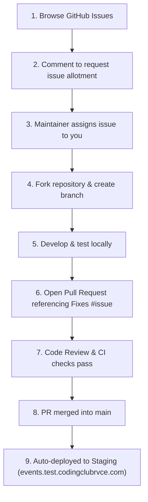

# 🤝 Contributing to RVCE Events

Welcome to the **RVCE Events** platform repository! This project is maintained and developed by the **RVCE Coding Club**. We are thrilled to have club members and juniors contribute to building our college's premier event discovery, registration, and attendance platform.

---

## 📋 Table of Contents
1. [Code of Conduct & Etiquette](#-code-of-conduct--etiquette)
2. [Contribution Workflow](#-contribution-workflow)
3. [Requesting Issue Allotment](#-requesting-issue-allotment)
4. [Issue Assignment & Inactivity Policy](#-issue-assignment--inactivity-policy)
5. [Local Development Setup](#-local-development-setup)
6. [Git & Commit Guidelines](#-git--commit-guidelines)
7. [Submitting a Pull Request](#-submitting-a-pull-request)
8. [CI/CD & Live Staging Previews](#-cicd--live-staging-previews)

---

## 📜 Code of Conduct & Etiquette
- Be respectful, constructive, and helpful to fellow contributors.
- **Do not start working on an issue without being assigned first** — this prevents multiple contributors from doing duplicate work.
- If you are assigned an issue and can no longer work on it, please leave a comment so it can be unassigned and allotted to someone else.

---

## 🚀 Contribution Workflow



---

## 🎯 Requesting Issue Allotment

1. Go to the [Issues tab](https://github.com/overclocked-2124/RVCE-events/issues).
2. Filter by labels like:
   - `good first issue` — Great beginner-friendly tasks for first-time contributors.
   - `help wanted` — Open tasks ready for someone to pick up.
   - `frontend` or `backend` — Based on your area of interest.
3. Check that the issue has **no Assignee** and is not labeled `assigned`.
4. Leave a comment expressing your interest:
   > *"Hi! I'd like to work on this issue. Could you please assign it to me?"*
5. Once a maintainer assigns you to the issue, you're ready to start coding!

---

## ⏱️ Issue Assignment & Inactivity Policy

To ensure tickets do not remain stalled and everyone in the community gets an opportunity to contribute, the repository enforces an automated inactivity lifecycle:

- **Day 3 (Inactivity Warning)**: If an assigned issue has no activity (comments, progress updates, or PR links) for **3 days**, GitHub Actions automatically leaves a comment pinging the assignee and adds the `stale-assignment` label.
- **Day 5 (Graceful Unassignment)**: If no response or activity occurs for **2 more days** (5 days total inactivity), the workflow automatically unassigns the issue and removes the `stale-assignment` label so other contributors can pick it up.
- **Keeping your ticket active**: Simply leave a comment on the issue with a progress update, ask for help, or link a draft PR. Any activity automatically resets the timer and clears the `stale-assignment` label!

---

## 💻 Local Development Setup

### Prerequisites
- **Node.js** (v20 or newer)
- **npm** (v10 or newer)
- **Docker & Docker Compose** (optional, for running full-stack containers)
- **Git**

### 1. Fork and Clone
```bash
# Fork the repository on GitHub, then clone your fork:
git clone https://github.com/<your-username>/RVCE-events.git
cd RVCE-events

# Add upstream remote to stay synced with main:
git remote add upstream https://github.com/overclocked-2124/RVCE-events.git
```

### 2. Frontend Development (Next.js)
```bash
cd frontend

# Install dependencies
npm install

# Start local development server
npm run dev
```
Open [http://localhost:3000](http://localhost:3000) in your browser to see your changes live.

### 3. Authentication & Dev Mock Auth Mode (Zero Config)
You **do not need Google Cloud credentials** to contribute and test authentication features locally!

- When running `npm run dev`, the landing page includes a **`[DEV MODE] Mock Sign-In Profiles`** drawer.
- With 1 click, you can simulate signing in as:
  - 🎓 **Student** (`ananya.cs23@rvce.edu.in`) $\rightarrow$ Tests successful login and protected route access.
  - 🏛️ **Faculty** (`principal@rvce.edu.in`) $\rightarrow$ Tests faculty session authorization.
  - 🚫 **Personal Gmail** (`personal.user@gmail.com`) $\rightarrow$ Tests institutional domain rejection and the access restriction error screen.

#### Testing with Real Google OAuth (Optional)
If you want to test the real Google OAuth 2.0 flow:
1. Copy `frontend/.env.example` to `frontend/.env.local`:
   ```bash
   cp frontend/.env.example frontend/.env.local
   ```
2. Create a free OAuth 2.0 Web Client in [Google Cloud Console](https://console.cloud.google.com/) with redirect URI `http://localhost:3000/api/auth/callback/google`.
3. Add your `GOOGLE_CLIENT_ID`, `GOOGLE_CLIENT_SECRET`, and a random 32+ character `AUTH_SECRET` to `frontend/.env.local`.

### 4. Verify Build, Tests & Linting Before Committing
Always ensure your code passes unit tests, lint checks, and builds cleanly:
```bash
cd frontend
npm test
npm run lint
npm run build
```

---

## 🌿 Git & Commit Guidelines

### Branch Naming
Create a dedicated feature branch for each issue:
- Features: `feat/issue-<number>-short-description` (e.g. `feat/issue-14-event-card-ui`)
- Bug fixes: `fix/issue-<number>-short-description` (e.g. `fix/issue-22-navbar-mobile-padding`)
- Documentation: `docs/issue-<number>-short-description`

### Conventional Commits
Use clear, semantic commit messages:
- `feat(frontend): add responsive event filter bar`
- `fix(frontend): resolve image aspect ratio distortion on mobile`
- `docs: update API contract specifications in docs/SYSTEM_DESIGN.md`
- `chore: update dependencies`

---

## 📬 Submitting a Pull Request

1. Push your branch to your GitHub fork:
   ```bash
   git push origin feat/issue-14-event-card-ui
   ```
2. Go to [RVCE-events Pull Requests](https://github.com/overclocked-2124/RVCE-events/pulls) and click **New Pull Request**.
3. Fill out the Pull Request template:
   - Reference the issue number in the description (e.g. **`Fixes #14`**). This links your PR to the issue and automatically closes it when merged.
   - **📸 Mandatory Screenshots for Frontend Changes**: Any PR that adds or modifies frontend UI/UX **MUST include screenshots or video recordings** (desktop and mobile views). Frontend PRs without visual proof will not be reviewed.
4. Ensure all CI checks (linting, build tests) pass on your PR.
5. Request a review from the maintainers. Address any code review feedback promptly.

---

## 🌐 CI/CD & Live Staging Previews

When your pull request is reviewed and merged into the `main` branch:
1. **GitHub Actions CI/CD** automatically triggers.
2. The frontend container image is built and published to GitHub Container Registry.
3. The change is **automatically deployed to the live Staging environment**:
   👉 **[https://events.test.codingclubrvce.com](https://events.test.codingclubrvce.com)**
4. You can immediately see and share your live contribution!
5. Maintainers periodically promote verified staging releases to **Production** at [https://events.codingclubrvce.com](https://events.codingclubrvce.com).

---

Thank you for contributing to the RVCE Coding Club! 🚀
