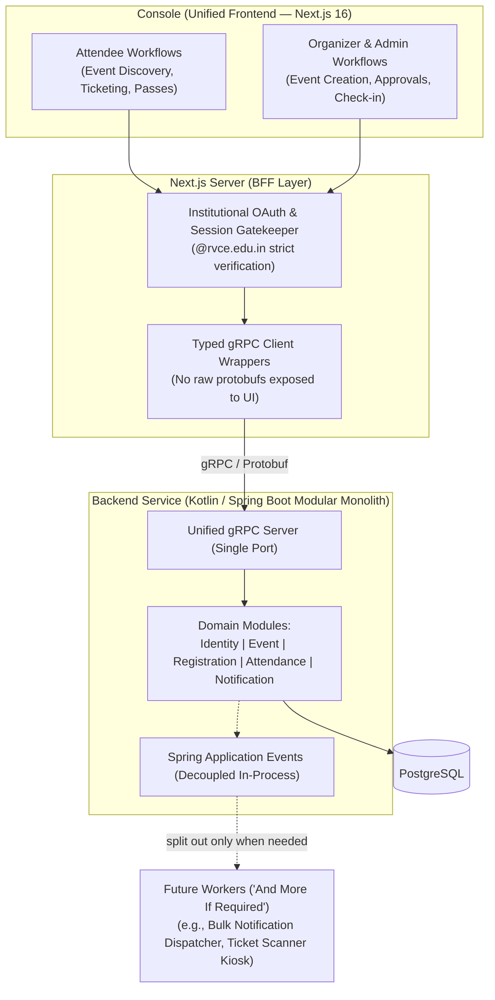
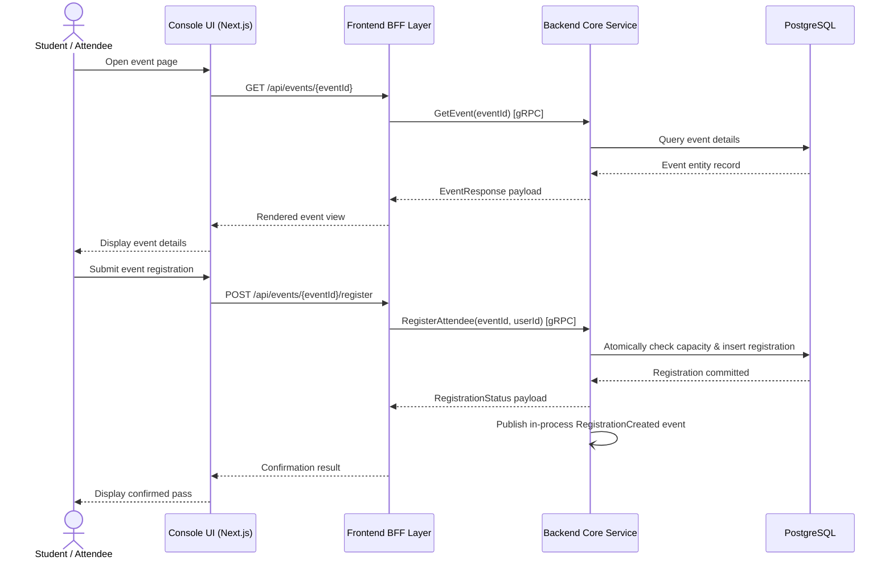
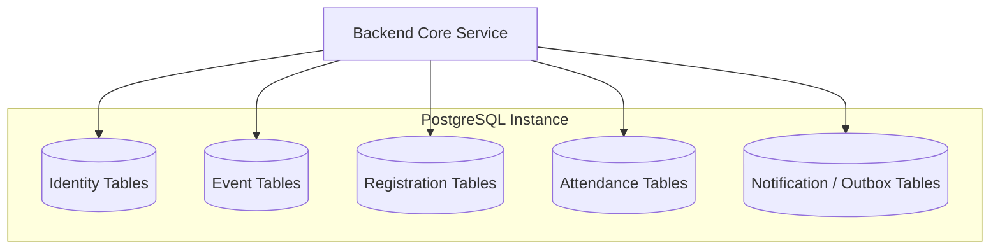

# RVCE Events — High-Level System Design

> Status: Approved Architecture
>
> This document defines the primary service boundaries, architectural tiers, and interaction patterns for the RVCE Events platform.

---

## 1. Goals

The system provides a self-hosted platform for discovering, publishing, registering for, and attending RVCE events.

The core architecture uses:

- **Console (Unified Frontend)**: TypeScript, React, Next.js 16 (App Router) serving all user roles—attendees, organizers, faculty, and administrators.
- **Frontend BFF**: Server-side Next.js translation and security layer enforcing institutional `@rvce.edu.in` OAuth sessions.
- **Backend Service (Modular Monolith)**: Unified Kotlin / Spring Boot application housing business domains (`identity`, `event`, `registration`, `attendance`, `notification`) in clean, isolated packages.
- **API Contract & Transport**: Protocol Buffers and gRPC for strongly typed backend communication.
- **Database & Migrations**: PostgreSQL with Liquibase for schema versioning.
- **Asynchronous Processing**: In-process Spring Application Events and transactional outbox pattern, architected for clean extraction into dedicated background worker services ("and more if required") as scale grows.

The design is deployment-neutral, lightweight, and engineered to run reliably on a self-hosted Linux VPS.

---

## 2. High-Level Architecture

The platform is structured into three primary tiers plus extensible background workers:



---

## 3. Request Flow

The browser communicates exclusively with the Next.js server-side BFF layer over browser-friendly HTTP/HTTPS. The BFF authenticates sessions, translates requests into backend gRPC calls, and shapes the responses for the Console UI.



---

## 4. Service & Tier Boundaries

### 4.1 Console (Unified Frontend)

Technology: TypeScript, React 19, Next.js 16 App Router.

Responsibilities:
- Acts as the **frontend for everything**: provides student/attendee discovery, registration, ticket viewing, and personal schedules alongside organizer event creation, approval tracking, and attendance scanning.
- Enforces strict Cobalt (`#4a32f9`) and Blush (`#fdcdd7`) design tokens via Tailwind CSS v4 CSS variables.
- Uses React Server Components by default for optimal page performance and SEO.
- Maintains companion Storybook stories (`.stories.tsx`) for every reusable UI component.
- Never directly imports raw protobuf stubs or calls backend gRPC ports.

### 4.2 Frontend BFF (Backend-For-Frontend)

Technology: Next.js server-side layer (Route Handlers and Server Actions).

Responsibilities:
- Exposes browser-facing HTTP endpoints and server actions.
- Enforces Google OAuth 2.0 authentication strictly restricted to institutional `@rvce.edu.in` accounts and `hd === 'rvce.edu.in'`.
- Manages encrypted, `HttpOnly`, `SameSite=Lax` JWT session cookies.
- Translates frontend actions into typed gRPC calls using wrapper clients in `frontend/src/bff/clients/`.
- Transforms and aggregates protobuf responses into UI-shaped models in `frontend/src/bff/mappers/`.
- Normalizes backend errors into frontend-safe messages.

### 4.3 Backend Service (Kotlin / Spring Boot Modular Monolith)

Technology: Kotlin 2.x, Java 21 (Temurin), Spring Boot 3.x, Gradle Kotlin DSL.

The backend is intentionally architected as a **Modular Monolith** rather than fragmented microservices. All domain modules run in a single JVM container, eliminating network hops, distributed transactions, and excessive RAM overhead while preserving strict package boundaries:

#### 4.3.1 Identity Module (`in.rvce.events.identity`)
- User accounts, institutional profile data, and role assignments (Attendee, Organizer, Club Lead, Faculty Admin).
- Authorization verification and permission checks for backend operations.

#### 4.3.2 Event Module (`in.rvce.events.event`)
- Event lifecycle: drafts, scheduling, venue allocation, categorization, and publishing.
- Submission and administrative approval workflows.
- Public event discovery, search, and featured event curation.

#### 4.3.3 Registration Module (`in.rvce.events.registration`)
- Capacity enforcement and atomic registration creation.
- Duplicate registration prevention and deadline validation.
- Waitlist ordering and automatic waitlist promotion.

#### 4.3.4 Attendance Module (`in.rvce.events.attendance`)
- QR code ticket generation and verification.
- Organizer check-in workflows (manual and scanner-assisted).
- Attendance records, present/absent timestamps, and post-event attendance summaries.

#### 4.3.5 Notification Module (`in.rvce.events.notification`)
- Notification templates and email dispatching preferences.
- Registration confirmations, ticket delivery, and event schedule change alerts.
- Consumes internal domain events asynchronously so user requests never block on email sending.

### 4.4 "And More If Required": Extensible Worker Architecture

As the platform scales, background workloads are designed for clean physical extraction without architectural refactoring:

- **Phase 1 (Default)**: Domain side-effects use Spring's in-process `ApplicationEventPublisher` and `@TransactionalEventListener` with transactional outbox records in PostgreSQL.
- **Phase 2 (Extensible)**: If bulk email delivery, scheduled reminders, or specialized check-in kiosk workloads require dedicated CPU/memory isolation, they can be extracted into a standalone worker container (`events-worker`) by swapping the event listener adapter with a message broker queue consumer.

---

## 5. Data Architecture

PostgreSQL 17 is the primary relational database. All domain modules share a single managed PostgreSQL instance, with clear schema or table-level domain ownership.



Rules:
- Schema changes are managed strictly via **Liquibase** changesets under `backend/database/liquibase/`, organized by domain.
- Modules may not directly query tables owned by another domain; cross-domain queries use internal domain services or event projections.
- Spring Data JPA is used for standard entity persistence; native SQL is reserved for performance-critical queries.

---

## 6. Communication Protocols

| Boundary | Transport | Format | Description |
| :--- | :--- | :--- | :--- |
| **Browser → BFF** | HTTP / HTTPS | JSON / HTML | Browser client navigation, form submissions, and server actions |
| **BFF → Backend** | gRPC | Protocol Buffers | Strongly typed internal RPC calls on loopback/bridge network |
| **Inter-Domain** | In-Memory Events | Typed Domain Events | Spring `ApplicationEvent` for asynchronous decoupling |
| **Future Workers** | Message Queue / Outbox | Serialized Event Payload | Extensible asynchronous pub/sub when dedicated workers are spun up |

---

## 7. Security & Authorization

- **Institutional OAuth**: Strictly limited to `@rvce.edu.in` accounts. Unauthorized personal accounts (`@gmail.com`) are rejected at the BFF boundary.
- **Stateless Encrypted Sessions**: Session tokens stored in encrypted `HttpOnly` JWT cookies signed with `HS256`.
- **Role-Based Access Control**: Backend validates user role (Attendee, Organizer, Faculty Admin) for all administrative and modifying operations.
- **Public Open-Source Hygiene**: Absolute zero tolerance for committed secrets. `.env` and `server.env` files are gitignored.

---

## 8. Repository Structure

```text
RVCE-events/
├── api/proto/                     ← Strongly typed Protocol Buffer contracts
├── backend/
│   ├── service/                   ← Unified Spring Boot Modular Monolith application
│   ├── libraries/                 ← Shared JVM libraries (auth-context, messaging, persistence)
│   └── database/liquibase/        ← Domain-scoped Liquibase migration changesets
├── frontend/                      ← The Console (Next.js 16 App Router + embedded BFF)
│   ├── app/                       ← App Router routes (attendee pages, organizer/admin console)
│   └── src/bff/                   ← BFF gRPC client wrappers and data mappers
├── deploy/                        ← Docker Compose and server environment templates
├── docs/                          ← Architecture, PRD, and ADR documentation
└── tests/                         ← Centralized Playwright, JVM, and smoke test suites
```

---

## 9. Architectural Decisions & Open Items

### Resolved Decisions
- **Consolidated Architecture**: Replaced 5 independent Spring Boot microservices with a single **Backend Service** (Modular Monolith), reducing idle memory consumption from ~3GB to ~512MB.
- **Unified Console**: Next.js serves as the comprehensive frontend client for all user roles, backed by its integrated BFF layer.
- **Worker Extensibility**: Decoupled domain events allow background workers to run in-process initially and cleanly extract into dedicated worker containers only when needed.

### Open Decisions
- Event image storage: local filesystem volume mount vs. self-hosted S3-compatible object store (e.g. MinIO).
- Ticketing QR code offline validation vs. real-time gRPC verification.
